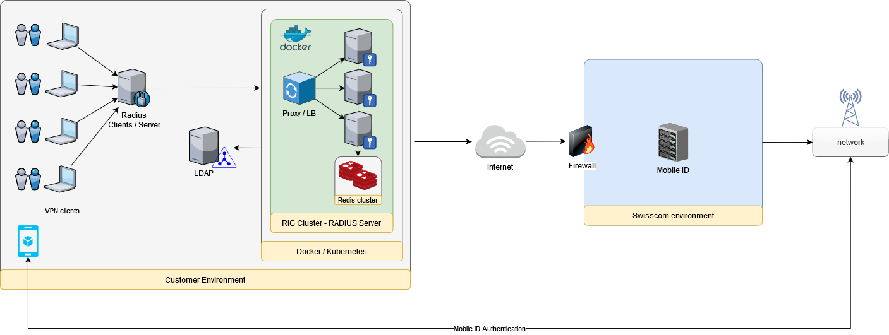

## What is MobileID Radius Interface Gateway?

 

The RIG (RADIUS Interface Gateway) application acts as an API Gateway for Mobile ID, exposing a RADIUS interface towards the clients and using the Mobile ID API at `mobileid.swisscom.com` for translating the requests of the (RADIUS-) clients into requests for the Mobile-ID service. 



The RIG application is the ideal solution in a setup in which an existing RADIUS-based network is taken from single factor authentication (User-Name + User-Password) or two-factor authentication (User-Name + User-Password plus a security device challenge) to a Multi-Factor Authentication, by customizing the authentication flow of a RADIUS session and introducing a new step that uses Mobile ID strong authentication means.

During the authentication via RADIUS, an extra step will require the users to confirm the access to the service on their mobile phones.

Some clients might decide to move from 1FA (one factor authentication) to 2FA: username + password and Mobile ID. Other clients might decide to stick to 2FA but replace the existing combination of username + password and security device challenge with username + password plus Mobile ID as additional MFA.
 
Please read our integration guide in [docs](https://github.com/MobileID-Strong-Authentication/mid-radius-rig/tree/main/docs)

### Features available with latest docker image
- Multitenancy Support
- Cloud-native microservice architecture for horizontal scalability
- Authentication: MobileID SIM
- Authentication: MobileID App
- Authentication: OTP (SMS) using Radius Access-Challenge flow
- Automatic Authentication Fallback with configurable priority
- Geofencing (whitelist or blacklist configuration, minimal confidence score)
- LDAP(S) Integration (attributes: userPassword, mobile, preferredLanguage, midSerial, preferredMFA)
- Optional MIDCHE-serial validation
- RADIUS Reply-Message for Access-Reject (error text fully configurable)
- Text SMS Notification for specific envents (such as inactive MobileID user, Access-Reject, ...)

### Features planned for future releases
- RADIUS Dynamic Fields: Allow radius clients to provide custom MSISDN, DTBD, Auth-Method
- Advanced RADIUS encryption (EAP-TLS, EAP-TTLS, PEAP, EAP-MD5, LEAP)
- RADIUS Proxy Mode (forward Access-Request after successful MFA to another 3rd party RADIUS server)

# How to use this image
## Prerequisities

In order to run this container you'll need docker installed.

- [Windows](https://docs.docker.com/windows/started)
- [OS X](https://docs.docker.com/mac/started/)
- [Linux](https://docs.docker.com/linux/started/)

In order to invoke MobileID MFA you'll need to have:

- A [MobileID Account](https://www.mobileid.ch/en/business-customers) and a valid `MID_CLIENT_CERTIFICATE`
- Source IP of the `mid-radius-rig` server whitelisted in the MobileID firewall

The container application `mid-radius-rig` has the following dependencies if you want to run this application in a clustered mode.

- [Redis](https://hub.docker.com/_/redis) key value store
- [Redis-Commander](https://hub.docker.com/r/rediscommander/redis-commander) is an optional application that you can use to easily manage Redis content such as customer configuration

## Usage

#### Default Ports

- `1812/udp` Radius port, required
- `80/tcp` Container health check port, optional

#### Docker Pull

You can pull the image either from [Docker Hub](https://hub.docker.com/r/mobileidch/mid-radius-rig) or from [Amazon ECR](https://gallery.ecr.aws/mobileidch/mid-radius-rig).

Pull image from Docker Hub:

```shell
$ docker pull mobileidch/mid-radius-rig
```

Pull image from Amazon ECR Public Gallery:

```shell
$ docker pull public.ecr.aws/mobileidch/mid-radius-rig
```

#### Docker Run

Refer to env-file samples referred in the next section.

```shell
$ docker run -d -p 1812:1812/udp --env-file <my-env-file> mobileidch/mid-radius-rig
```

or

```shell
$ docker run -d -p 1812:1812/udp --env-file <my-env-file> public.ecr.aws/mobileidch/mid-radius-rig
```

### Sample Environment Setup

#### Development Environment

In this setup we run a single RIG container instance with in-memory data source.
This is a very simplified setup for testing purpose only and we don't need a Redis database.

However, One-Time-Password (OTP) authentication is not supported without the use of a Redis database!

The sample env-file contains all the configuration variables, including a sample error message configuration and customer configuration.

* [ENV-file sample for using in-memory data source](https://github.com/MobileID-Strong-Authentication/mid-radius-rig/raw/main/samples/production-v1.0-noRedis.env.sample)

#### Production

In this setup can run multiple RIG container instances. Redis is used as data source and for the configuration of customers and error messages.
You may use [Redis-Commander](https://hub.docker.com/r/rediscommander/redis-commander) to manage customer configuration easily.

* [ENV-file sample for using Redis as data source](https://github.com/MobileID-Strong-Authentication/mid-radius-rig/raw/main/samples/production-v1.0.env.sample)
* [Sample Customer JSON](https://github.com/MobileID-Strong-Authentication/mid-radius-rig/raw/main/samples/redis-customer-configuration.sample)
* [Sample I18N Error Message JSON](https://github.com/MobileID-Strong-Authentication/mid-radius-rig/raw/main/samples/redis-i18n-errormsg-configuration.sample)

## Docker Compose
#### Sample YAML

With Compose, we can create a YAML file to define the services and with a single command, can spin everything up or tear it all down.
With this sample, we start multiple RIG container instances. Using the sample docker-compose.yml file below, we can run additional container applications such as Redis, Redis-Commander and NGINX:

- 1 or several container(s) of `mid-radius-rig`
- 1x `redis` container to have a Redis database
- 1x `redis-commander` container to have a Redis UI to manage the customer configuration
- 1x `nginx` container to have a UDP network load balancer (see custom `nginx.conf` file)

Sample YAML and NGINX configuration files:

* [Sample docker-compose.yml](https://github.com/MobileID-Strong-Authentication/mid-radius-rig/raw/main/samples/docker-compose.yml)
* [Sample nginx.conf](https://github.com/MobileID-Strong-Authentication/mid-radius-rig/raw/main/samples/nginx.conf)

Please make sure that both `docker-compose.yml` and `nginx.conf` exist in the same directory before you run the command below.

```
$ docker-compose up --scale mid-radius-rig=3
```

## Radius Client Test

`radclient` is a radius client program. It can send arbitrary radius packets to a radius server, then shows the reply. It can be used to test changes you made in the configuration of the radius server, or it  can  be  used  to monitor if a radius server is up.

RIG customer configuration without LDAP: 

```
$ echo "User-Name=<MyMobileNumber@mycompany.com>,NAS-Identifier=<ch_mycompany>" | radclient -c 1 -r 1 -x -t 30 <server-ip> auth <shared-secret>
```

...in case of MobileID OTP (SMS) you will get an `Access-Challenge` response that includes a `state` value. You must respond with another `Access-Request` that includes the OTP value as `User-Password`-attribute and the retrieved `state` value as `State`-attribute: 

```
$ echo "User-Name=<MyMobileNumber@mycompany.com>,User-Password=<user-password>,State=<state>,NAS-Identifier=<ch_mycompany>" | radclient -c 1 -r 1 -x -t 30 <server-ip> auth <shared-secret> 
```

RIG customer configuration with LDAP (`mid-radius-rig` will retrieve the user's mobile number using LDAP)

```
$ echo "User-Name=<username>,User-Password=<user-password>,NAS-Identifier=<ch_mycompany>" | radclient -c 1 -r 1 -x -t 30 <server-ip> auth <shared-secret>
```

## Troubleshooting
#### RADIUS Client
Please ensure that your RADIUS client settings are correctly set:
* RADIUS client `Timeout` set to `60 seconds`. This will ensure enough time for the user to respond to the MobileID authentication request.
* RADIUS client `Retry` set to no more than `1`. The client should not retry because there might be still a MobileID authentication session on-going.

#### LDAP

When troubleshooting issues it may be useful to test user credentials directly against the LDAP server.
Testing user authentication with ldapwhoami:

```
$ ldapwhoami -x -w <passwd> -D "cn=<tbd>,ou=<tbd>,dc=<tbd>,dc=<tbd>" -H ldap://<ldap.myserver.com>:389
```

Using ldapsearch to debug LDAP configuration problems:

```
$ ldapsearch -LLL -H ldap://<ldap.myserver.com>:389 -b "ou=<tbd>,dc=<tbd>,dc=<tbd>" -D "cn=<admin>,dc=<tbd>,dc=<tbd>" -w <passwd> -s sub "(&(objectclass=inetOrgPerson)(uid=<user>))"
```

#### Connectivity Test

There are many ways how to verify the connectivity to a remote host.
In case you have `openssl` installed you may try these commands to verify the connectivity to these endpoints:

```
$ openssl s_client -connect mobileid.swisscom.com:443
```

```
$ openssl s_client -connect ldap.mobileid.tech:389
```

## Contact

- **Maintained by:** [Swisscom (Switzerland) Ltd](https://www.swisscom.ch/mid)
- **Where to get help:** [mobileid.ch](https://www.mobileid.ch/en/contact)

## License

This project is licensed under the MIT License.
